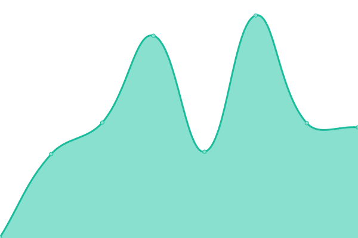

# [📈 Live Status](https://demo.upptime.js.org): <!--live status--> **Все системы работают.**

This repository contains the open-source uptime monitor and status page for [Upptime](https://upptime.js.org), powered by [Upptime](https://github.com/upptime/upptime).

With [Upptime](https://upptime.js.org), you can get your own unlimited and free uptime monitor and status page, powered entirely by a GitHub repository. We use [Issues](https://github.com/upptime/upptime/issues) as incident reports, [Actions](https://github.com/HELPY4/upptime/actions) as uptime monitors, and [Pages](https://demo.upptime.js.org) for the status page.

<!--start: status pages-->
<!-- This summary is generated by Upptime (https://github.com/upptime/upptime) -->
<!-- Do not edit this manually, your changes will be overwritten -->
<!-- prettier-ignore -->
| URL | Status | History | Response Time | Uptime |
| --- | ------ | ------- | ------------- | ------ |
|  [Cloudflare](https://cloudflare.com) | 🟩 Up | [cloudflare.yml](https://github.com/HELPY4/upptime/commits/HEAD/history/cloudflare.yml) | 

 277ms
     
 | 

<a href="https://status.romax-host.ru/history/cloudflare">100.00%</a>
    

|  [Панель panel.helpy4.ru](https://panel.helpy4.ru) | 🟩 Up | [panel-panel-helpy4-ru.yml](https://github.com/HELPY4/upptime/commits/HEAD/history/panel-panel-helpy4-ru.yml) | 

 737ms
     
 | 

<a href="https://status.romax-host.ru/history/panel-panel-helpy4-ru">99.69%</a>
    

|  [Облако cloud.romax-host.ru:4444](cloud.romax-host.ru) | 🟩 Up | [oblako-cloud-romax-host-ru-4444.yml](https://github.com/HELPY4/upptime/commits/HEAD/history/oblako-cloud-romax-host-ru-4444.yml) | 

 690ms
     
 | 

<a href="https://status.romax-host.ru/history/oblako-cloud-romax-host-ru-4444">100.00%</a>
    

|  [Управление хостингом](https://pve.helpy4.ru) | 🟩 Up | [upravlenie-hostingom.yml](https://github.com/HELPY4/upptime/commits/HEAD/history/upravlenie-hostingom.yml) | 

 1160ms
     
 | 

<a href="https://status.romax-host.ru/history/upravlenie-hostingom">100.00%</a>
    

<!--end: status pages-->

[**Visit our status website →**](https://demo.upptime.js.org)

## 📄 License

- Powered by: [Upptime](https://github.com/upptime/upptime)
- Code: [MIT](./LICENSE) © [Anand Chowdhary](https://anandchowdhary.com), supported by [Pabio](https://pabio.com)
- Data in the `./history` directory: [Open Database License](https://opendatacommons.org/licenses/odbl/1-0/)
